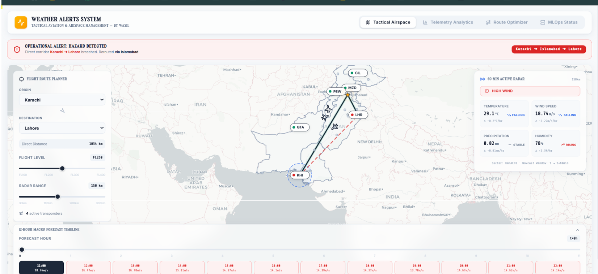
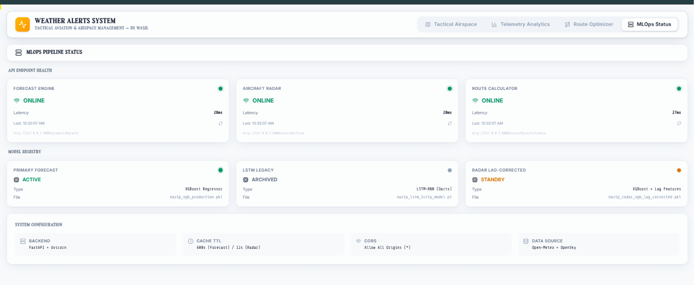
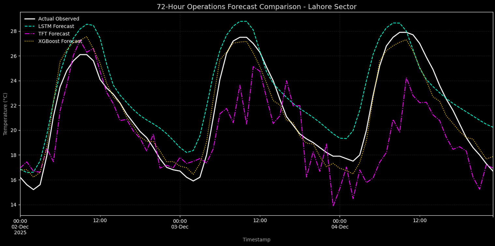

<div align="center">
  <br>
  <h1>ATMOSFLOW</h1>
  <p><strong>Geospatial Time-Series Nowcasting & Dynamic Evasion Routing Engine</strong></p>

  <p>
    
    
    
    
  </p>
  <br>
</div>

---

### 📌 System Overview

**AtmosFlow** is an end-to-end meteorological intelligence platform integrating localized time-series nowcasting with dynamic graph routing algorithms. Engineered for mission-critical operations, the platform ingests continuous atmospheric telemetry, identifies convective hazard boundaries, and recalculates optimal transit corridors in real time.

<div align="center">
  
  <p><em>Real-time corridor rerouting via pruned Dijkstra algorithm upon detected convective hazards.</em></p>
</div>

---

### ⚙️ Architecture & Core Modules

* **Dynamic Graph Evasion (Dijkstra):** Corridors are modeled as an interconnected coordinate graph. When predicted threshold limits (e.g., wind shear $> 10\,\text{m/s}$) are breached in a given sector, the affected nodes are programmatically penalized/blocked, forcing an instant recalculation of the safest path.
* **Delta-Fetching Pipeline:** High-efficiency data ingestion engine that mathematically isolates missing time slices from remote APIs, merging deltas with local caches to eliminate redundant calls and prevent rate-limiting.
* **Continuous Training (CT) Loop:** Decoupled background service managing periodic retraining cycles to combat feature and concept drift across sensor stations.

<div align="center">
  <br>
  
  <p><em>Decoupled ASGI backend monitoring endpoint latencies, cache TTLs, and active model registry states.</em></p>
  <br>
</div>

---

### 📊 Model Benchmark Evaluation

The production XGBoost pipeline was evaluated against temporal deep learning baselines (LSTM and Temporal Fusion Transformers) across multi-day operational forecast horizons:

<div align="center">
  
  <p><em>72-Hour Operations Forecast Comparison across local telemetry sensors.</em></p>
</div>

| Architecture | Operational Fit | Latency (Per Node) | Error Tracking |
| :--- | :--- | :--- | :--- |
| **XGBoost (Production)** | High fidelity tracking of diurnal peak fluctuations[cite: 13] | **$\approx$ 28ms**[cite: 14] | Lowest peak dispersion[cite: 13] |
| **LSTM Recurrent** | Smooth trending, over-predicts low-temperature troughs[cite: 13] | $\approx$ 120ms | Moderate phase lag[cite: 13] |
| **TFT (Transformer)** | High variance under abrupt local atmospheric shifts[cite: 13] | $\approx$ 240ms | High micro-scale noise[cite: 13] |

---

### 🚀 Getting Started

#### 1. Environment Configuration
```bash
git clone [https://github.com/wasil-7/weather-predictory.git](https://github.com/wasil-7/weather-predictory.git)
cd weather-predictory
python -m venv .venv
.venv\Scripts\activate
pip install -r requirements.txt
```

#### 2. Run API & Routing Backend
```bash
uvicorn main:app --reload --port 8000
```

#### 3. Execute Model Retraining Cycle
```bash
python retrain_pipeline.py
# Or run via orchestrator:
./run_mlops.bat
```
